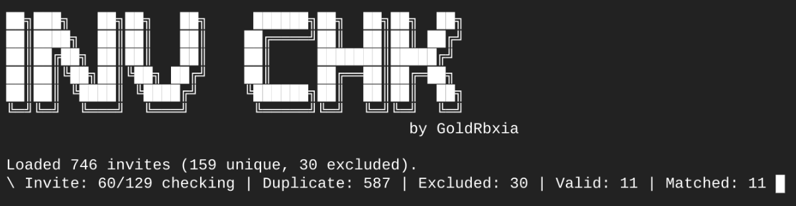

# Discord Invite Checker (Custom Config)

A customizable tool to filter and validate Discord invites based on configured criteria. This tool also supports excluding specific invites using an `excluded.txt` file and dynamically tracks the progress of the checking process. (This was made to be used for filling tkns and expanding your snipe tkns)



---

## 🚀 Features

- 🛠 **Configurable**: Modify invite criteria using `config.json`.
- ❌ **Excluded Invites**: Skip specific invites using an `excluded.txt` file.
- 📄 **Dynamic Logging**: Real-time status updates during invite validation.
- ✅ **Output Results**: Save valid invites to `output.txt` for further use.
---

## 🛠 Setup Instructions

### 1. Prerequisites
- [Node.js](https://nodejs.org) installed on your system (version 18 or higher).
- Basic knowledge of Node.js and command-line usage.

### 2. Clone the Repository
Clone this repository to your local machine:
```bash
git clone https://github.com/GoldRbxia12/discord-invite-checker
cd discord-invite-checker
```

### 3. Install Dependencies
This script does not require any external dependencies other than Node.js. However, it uses the built-in `fs` and `axios` libraries.

If `axios` is not installed, you can install it using npm:
```bash
npm install axios
```

---

## 🔧 Configuration

### 1. `config.json`
This file controls the invite filtering criteria. Modify the file to suit your requirements:
```json
{
  "minBoost": 0,             // Minimum server boosts
  "minOnlineMembers": 51,    // Minimum number of online members
  "minMembers": 150,         // Minimum total members
  "maxMembers": 750000       // Maximum total members
}
```

### 2. `invites.txt`
This file should contain the invite codes (one per line) that you want to validate. **Only include the invite code, not the full URL.**

Example:
```
abcdef
ghijkl
mnopqr
```

### 3. `excluded.txt`
This file allows you to specify invite codes that should be excluded from validation. Any invite codes listed here will be skipped, and the exclusion will be logged in the console.

Example:
```
abcdef
mnopqr
```

---

## ▶️ How to Run

1. Ensure the required files (`config.json`, `invites.txt`, and optionally `excluded.txt`) are set up in the same directory as the script.

2. Run the script using Node.js:
```bash
node index.js
```

---

## 📄 Outputs

- **Real-time Logs**: The console will display the progress of invite validation, including duplicates, exclusions, and matches.
- **Valid Invites**: All valid invites that meet the criteria in `config.json` will be saved to `output.txt`.

Example of console output:
```
Loaded 100 invites (70 unique, 5 excluded).
| Invite: 5/70 checking | Duplicate: 30 | Excluded: 5 | Valid: 0 | Matched: 0
Saved 10 valid invites to "output.txt".
```

---

## 📂 File Overview

| File Name       | Description                                                                 |
|------------------|-----------------------------------------------------------------------------|
| `config.json`    | Configuration file for invite filtering criteria.                          |
| `invites.txt`    | List of invite codes to validate (one per line).                           |
| `excluded.txt`   | List of invite codes to exclude from validation (optional).                |
| `output.txt`     | Contains all valid invites that meet the criteria in `config.json`.        |
| `index.js` | The main script for running the invite checker.                 |

---

## ⚠️ Notes

- Ensure you respect Discord's API rate limits to avoid temporary bans.
- If the script doesn't run, make sure all required files (`config.json`, `invites.txt`) are properly set up.
- The script only processes unique invite codes and skips duplicates automatically.

---

## Credits
Developed by **GoldRbxia**
Contributions are welcomed!
